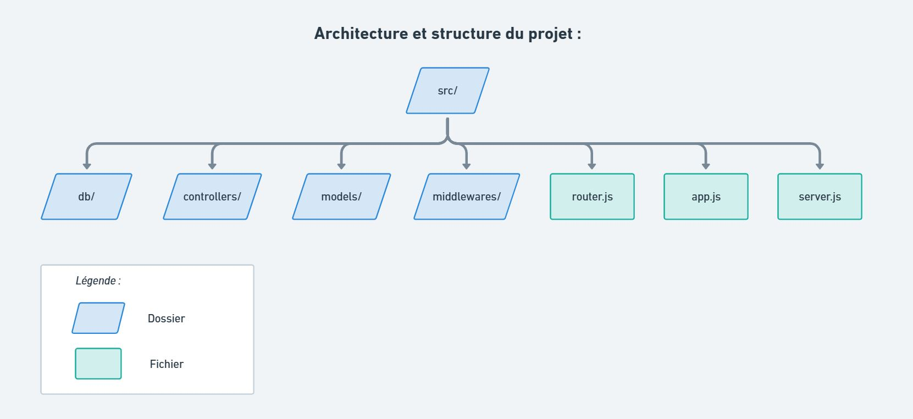

# Backend Auth API - JWT + Refresh et Access Token

Dernière mise à jour : 25/02/2026

Backend d'authentification développé avec Node.js, Express et PostgreSQL.

Le projet comprend un système complet d'authentification sécurisé basé sur :

- Access Token JWT (courte durée de vie)
- Refresh Token stocké en cookie httpOnly
- Gestion de session en base de donnée

---

## Stack

- Node.js
- Express
- bcrypt
- JWT
- cookie-parser
- PostgreSQL
- RestClient (tests des requêtes HTTP)

---

## Architecture

Une architecture MVC fut utilisée pour l'élaboration du projet :

<details>
    <summary>Fichier représentatif de l'architecture du projet</summary>
    <br>
    
</details>

## Fonctionnalités implémentées

### Authentification

- POST `/api/auth/login`
- POST `/api/auth/refresh`
- POST `/api/auth/logout`

### Route protégée

- GET `/api/user/me`

---

## Sécurité

### Access Token

- JWT signé avec clé secrète
- Durée de vie : 15 minutes
- Contient `sub` <i>(subject)</i> : userId

### Refresh Token

- Généré de façon aléatoire via `crypto.randomBytes`
- Hash `SHA-256` stocké en base de donnée
- Cookie `httpOnly`
- Durée de vie : 7 jours
- Révocation possible (après logout)

### Protection implémentée

- Messages d'erreur génériques (anti-énumération)
- Vérification `Bearer` Token
- Vérification signature JWT
- Vérification expiration
- Vérification session valide en base de donnée
- Révocation des sessions

---

## Installation

``` bash
git clone https://github.com/Anthony-Hannoteaux/jwt-authentication-fullstack
cd backend
npm install
```

Créer un fichier `.env` (voir modèle `.env.example`) :

```bash
PORT=
PGUSER=
PGHOST=
PGPASSWORD=
PGDATABASE=
PGPORT=
JWT_SECRET=
```

Après avoir initialisé les valeurs des variables d'environnement.
<br>
Lancer le serveur :

```bash
npm run dev
```

## Evolutions possibles/prévues

- Ajout CORS pour intégration front React
- Rotation des refresh tokens
- Nettoyage automatique des sessions expirées
- Ajout de méthodes CRUD complémentaires (création d'un nouvel utilisateur)
- Sécure cookies en production (HTTPS)